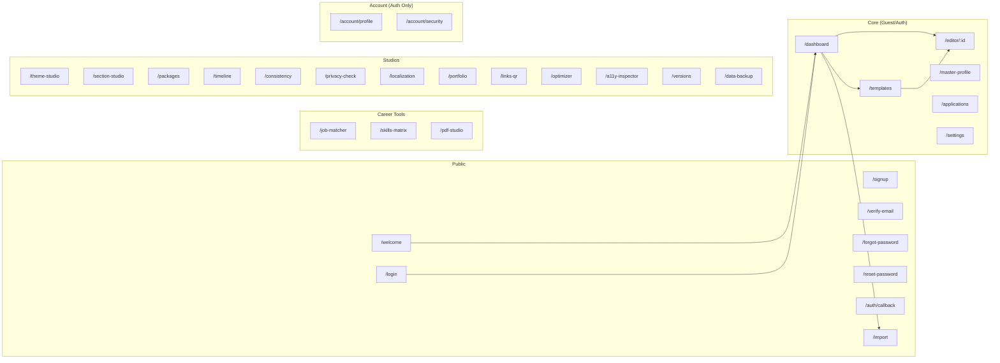

# Application Routes

> CareerCanvas Application Guide | Generated: 2026-08-12

---

## Routing Mechanism

CareerCanvas uses a hash-based SPA router. All URLs take the form `#/path`. Route parameters use `:param` syntax (e.g., `/editor/:id`). Navigation guards enforce authentication requirements and unsaved-changes confirmation.

**Default route:** `/dashboard`
**404 handling:** Falls back to default route

---

## Complete Route Map (34 Routes)

### Core Application Routes (6)

| Route | Page | Purpose | Access | Load |
|-------|------|---------|--------|------|
| `/dashboard` | Dashboard | Document list, quick actions, stats | Guest/Auth | Eager |
| `/editor/:id` | Editor | Resume/CV/document editor | Guest/Auth | Eager |
| `/templates` | Template Gallery | Browse, preview, apply templates | Guest/Auth | Eager |
| `/master-profile` | Master Profile | Unified professional profile | Guest/Auth | Eager |
| `/applications` | Application Tracker | Job application pipeline | Guest/Auth | Eager |
| `/settings` | Settings | Preferences, data, privacy | Guest/Auth | Eager |

### Import Route (1)

| Route | Page | Purpose | Access | Load |
|-------|------|---------|--------|------|
| `/import` | Import | File import (JSON, DOCX, PDF, TXT) | Public | Eager |

### Career Tool Routes (3)

| Route | Page | Purpose | Access | Load |
|-------|------|---------|--------|------|
| `/job-matcher` | Job Matcher | Resume vs. job description analysis | Guest/Auth | Lazy |
| `/skills-matrix` | Skills Matrix | Skills evidence analysis | Guest/Auth | Lazy |
| `/pdf-studio` | PDF Studio | PDF viewer and inspector | Guest/Auth | Lazy |

### Studio Routes (14)

| Route | Page | Purpose | Access | Load |
|-------|------|---------|--------|------|
| `/theme-studio` | Theme Studio | App UI theme customization | Guest/Auth | Lazy |
| `/section-studio` | Section Studio | Custom section builder | Guest/Auth | Lazy |
| `/packages` | Package Studio | Application package bundling | Guest/Auth | Lazy |
| `/timeline` | Timeline Studio | Career timeline visualization | Guest/Auth | Lazy |
| `/consistency` | Consistency Studio | Document consistency checker | Guest/Auth | Lazy |
| `/privacy-check` | Privacy Studio | PII/sensitive data scanner | Guest/Auth | Lazy |
| `/localization` | Localization Studio | Locale-specific settings | Guest/Auth | Lazy |
| `/portfolio` | Portfolio Studio | Static portfolio builder | Guest/Auth | Lazy |
| `/links-qr` | Link/QR Studio | Link management + QR codes | Guest/Auth | Lazy |
| `/optimizer` | Space Optimizer | Space usage optimization | Guest/Auth | Lazy |
| `/a11y-inspector` | A11y Inspector | Accessibility analysis | Guest/Auth | Lazy |
| `/versions` | Version Studio | Document version management | Guest/Auth | Lazy |
| `/data-backup` | Data Studio | Data management and backup | Guest/Auth | Lazy |
| `/stress-lab` | Stress Lab | Template stress testing (dev) | Guest/Auth | Lazy |

### Authentication Routes (9)

| Route | Page | Purpose | Access | Load |
|-------|------|---------|--------|------|
| `/welcome` | Welcome | Landing page, first-time visitor | Public | Lazy |
| `/login` | Login | Email/password sign-in | Public | Lazy |
| `/signup` | Sign Up | Account registration | Public | Lazy |
| `/verify-email` | Verify Email | Email verification confirmation | Public | Lazy |
| `/forgot-password` | Forgot Password | Password reset request | Public | Lazy |
| `/reset-password` | Reset Password | New password entry | Public | Lazy |
| `/auth/callback` | Auth Callback | OAuth/magic link callback | Public | Lazy |
| `/account/profile` | Account Profile | Display name, email | Auth only | Lazy |
| `/account/security` | Account Security | Password change, account deletion | Auth only | Lazy |

### Hidden Routes (1)

| Route | Page | Notes |
|-------|------|-------|
| `/stress-lab` | Stress Lab | No navigation link; accessible only via manual URL |

---

## Route Diagram

---

## Navigation Structure

### Desktop Navigation Bar
- Dashboard, Profile, Applications, Templates, Tools (dropdown), Settings

### Tools Dropdown (16 items)
JD Matcher, Skills Matrix, Theme Studio, Section Studio, PDF Studio, Packages, Timeline, Consistency, Privacy Check, Optimizer, Accessibility, Versions, Portfolio, Links & QR, Localization, Data & Backup

### Mobile Navigation Drawer
Same links as desktop, shown in a slide-out drawer via hamburger menu

### Editor Mobile Tabs (4)
Edit, Preview, Design, Export

---

## Route Guards

1. **Unsaved changes**: Prompts confirmation when navigating away from editor with unsaved changes
2. **Authentication gate**: Non-public routes require guest mode or authentication
3. **Auth route redirects**: `/welcome`, `/login`, `/signup` redirect to `/dashboard` if already authenticated
4. **Account routes**: `/account/profile` and `/account/security` redirect to `/login` if not authenticated
5. **Public routes**: `/welcome`, `/login`, `/signup`, `/verify-email`, `/forgot-password`, `/reset-password`, `/auth/callback`, `/import` bypass the auth gate
