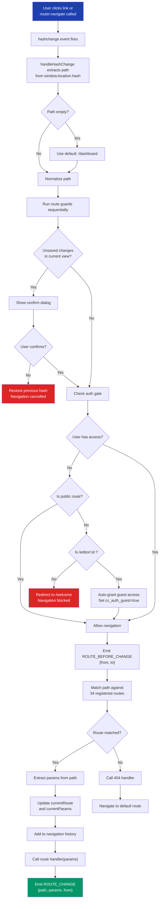
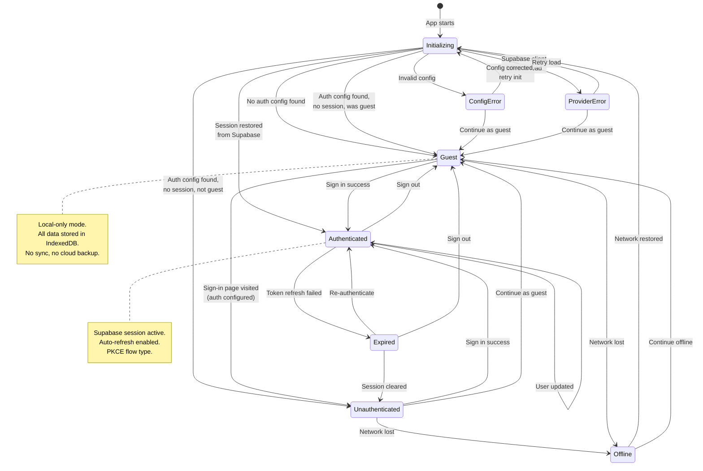
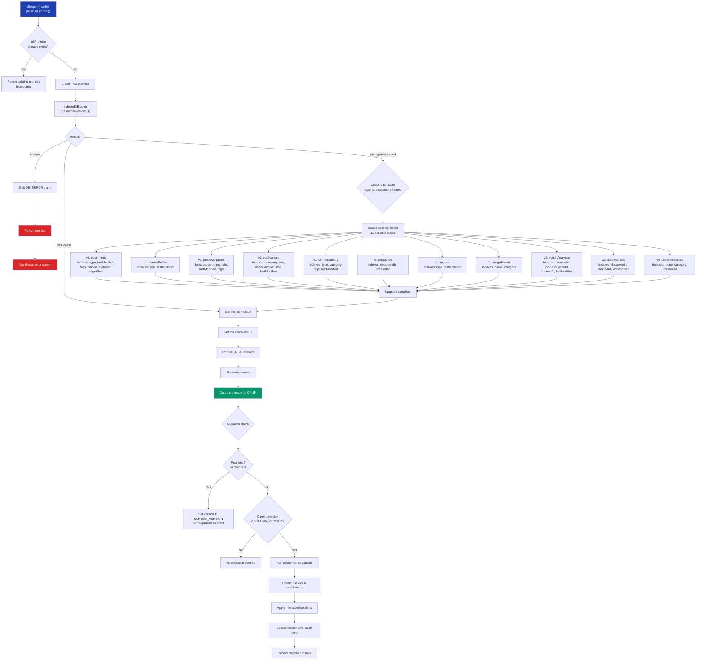

# Application Flow
> CareerCanvas Application Guide | Generated: 2026-08-12

This document describes the complete lifecycle of the CareerCanvas application, from initial page load through user interaction. Every detail is derived from the actual source code.

---

## Table of Contents

1. [Startup Flow](#1-startup-flow)
2. [Route Handling](#2-route-handling)
3. [Database Initialization](#3-database-initialization)
4. [Event System](#4-event-system)
5. [Template Registration](#5-template-registration)
6. [Authentication Flow](#6-authentication-flow)
7. [Mermaid Diagrams](#7-mermaid-diagrams)

---

## 1. Startup Flow

The application boots through a deterministic sequence of steps. Each step depends on the successful completion of the one before it.

### Step 1: Browser Loads `index.html`

The browser fetches the single HTML entry point. The `<head>` loads 25+ CSS files (variables, reset, base, layout, components, and feature-specific stylesheets). The `<body>` contains a loading placeholder inside `<div id="app">` that displays the CareerCanvas logo with a pulse animation and "Loading CareerCanvas..." text.

### Step 2: Service Worker Cleanup

An inline `<script>` block (non-module, runs immediately) unregisters all existing service workers and deletes all caches:

```javascript
if ('serviceWorker' in navigator) {
  navigator.serviceWorker.getRegistrations().then(function(registrations) {
    for (var reg of registrations) { reg.unregister(); }
  });
  caches.keys().then(function(names) {
    for (var name of names) { caches.delete(name); }
  });
}
```

This ensures no stale service worker interferes with the application.

### Step 3: Theme Engine IIFE

The `ThemeEngine` class reads the stored theme from `localStorage` key `cc_app_theme`. The default theme is `midnight-professional` (a dark navy theme with cyan accents). The engine applies the selected theme's tokens as CSS custom properties on the document root via the `data-theme` attribute.

### Step 4: Module Loading

The `<script type="module" src="src/js/app.js">` tag loads the application entry point. This module imports 22 dependencies:

| Category | Imports |
|----------|---------|
| Core | `StateManager`, `Database`, `Router`, `EventBus` (singleton), `TemplateEngine`, `ThemeEngine` |
| Schema | `createEmptyDocument` |
| UI | `Toast`, `Modal` |
| Modules | `Dashboard`, `ResumeEditor`, `OnboardingWizard`, `TemplateGallery`, `DesignPanel`, `ATSChecker`, `ExportManager`, `ImportManager`, `MasterProfile`, `SettingsPanel`, `ApplicationTracker`, `ExperienceCalculator` |
| Templates | `registerAllTemplates` |
| Auth | `initializeAuth`, `continueAsGuest`, `signOut`, `authState`, `AUTH_STATUS` |

### Step 5: CareerCanvasApp Constructor

The constructor instantiates core services immediately (synchronous):

```
this.state          = new StateManager()
this.db             = null                    // deferred to init()
this.router         = new Router()
this.events         = eventBusSingleton       // global singleton
this.toast          = new Toast()
this.modal          = new Modal()
this.templateEngine = new TemplateEngine()
this.exportManager  = new ExportManager()
this.importManager  = new ImportManager()
this.atsChecker     = new ATSChecker()
this.themeEngine    = new ThemeEngine()
this.currentView    = null
this.appEl          = document.getElementById('app')
```

### Step 6: `init()` Method (Async)

The `init()` method orchestrates the full application startup:

1. **Database open** -- Creates a `Database` instance, calls `this.db.open()` (alias for `init()`), which opens IndexedDB `careercanvas-db` at version 4
2. **Template registration** -- Calls `registerAllTemplates(this.templateEngine)`, registering 68 templates from 9 category files
3. **Global context** -- Calls `setupGlobalContext()`, exposing `window.CC` with references to all core services
4. **Route setup** -- Calls `setupRoutes()`, registering 34 routes with the router
5. **Event setup** -- Calls `setupGlobalEvents()`, wiring up global event listeners
6. **Keyboard shortcuts** -- Calls `setupKeyboardShortcuts()`
7. **Shell render** -- Calls `renderShell()`, replacing the loading placeholder with the full app shell (header, nav, main, mobile drawer, toast container, modal container, watermark)
8. **Theme setup** -- Calls `setupTheme()`, initializing the theme engine with stored preferences

### Step 7: Authentication Initialization (Non-Blocking)

Auth is initialized with a fire-and-forget pattern:

```javascript
initializeAuth().catch(e => console.warn('Auth init:', e.message));
```

The auth initialization sequence:
1. Sets auth status to `INITIALIZING`
2. Calls `loadAuthConfig()` which attempts to `fetch('/api/public-config')`
3. If the fetch fails, checks for `window.__CC_AUTH_CONFIG__` (static config fallback)
4. If no config is found, sets `configured: false` and enters `GUEST` mode
5. If config is found and Supabase is configured, loads the Supabase client and restores the session

### Step 8: First-Time Visitor Check

After auth initialization is dispatched, the app checks visitor status:

```javascript
const hasVisited = localStorage.getItem('onboardingComplete')
                || localStorage.getItem('cc_auth_guest')
                || authState.isAuthenticated();
```

**If first-time visitor** (none of the above are truthy):
- Router starts
- Router navigates to `/welcome`

**If returning visitor**:
- Checks if `onboardingComplete` is set
- If not, checks if user already has documents in the database (e.g., from import)
  - If documents exist: sets `onboardingComplete` to `'true'` and skips the wizard
  - If no documents: shows the onboarding wizard
- Router starts (handles the current hash or defaults to `/dashboard`)

### Step 9: Router Start and Initial Navigation

`this.router.start()` calls `this.init()` on the Router, which:
1. Adds a `hashchange` event listener on `window`
2. Sets `this.initialized = true`
3. Immediately calls `handleHashChange()` to process the current URL hash
4. The hash is parsed, guards are evaluated, and the matching route handler is invoked

### Step 10: Post-Init

After all initialization succeeds, `setupStorageWarning()` is called to monitor IndexedDB storage quotas and warn users if storage is running low.

If `init()` throws at any point, the error is caught and the `#app` element displays a red error screen with the error message.

---

## 2. Route Handling

### Hash-Based Routing

CareerCanvas uses hash-based client-side routing. All routes are prefixed with `#/` in the URL (e.g., `#/dashboard`, `#/editor/abc123`).

### Registered Routes (34 Total)

| # | Route | View | Category |
|---|-------|------|----------|
| 1 | `/dashboard` | Dashboard | Core |
| 2 | `/editor/:id` | Resume Editor | Core |
| 3 | `/templates` | Template Gallery | Core |
| 4 | `/master-profile` | Master Profile | Core |
| 5 | `/applications` | Application Tracker | Core |
| 6 | `/settings` | Settings Panel | Core |
| 7 | `/job-matcher` | JD Matcher | Tools |
| 8 | `/skills-matrix` | Skills Matrix | Tools |
| 9 | `/theme-studio` | Theme Studio | Tools |
| 10 | `/section-studio` | Section Studio | Tools |
| 11 | `/pdf-studio` | PDF Studio | Tools |
| 12 | `/packages` | Package Builder | Tools |
| 13 | `/timeline` | Timeline View | Tools |
| 14 | `/consistency` | Consistency Checker | Tools |
| 15 | `/privacy-check` | Privacy Check | Tools |
| 16 | `/localization` | Localization Studio | Tools |
| 17 | `/portfolio` | Portfolio Studio | Tools |
| 18 | `/links-qr` | Links & QR | Tools |
| 19 | `/optimizer` | Space Optimizer | Tools |
| 20 | `/a11y-inspector` | Accessibility Inspector | Tools |
| 21 | `/versions` | Version History | Tools |
| 22 | `/data-backup` | Data & Backup | Tools |
| 23 | `/stress-lab` | Stress Lab | Tools |
| 24 | `/import` | Import | Utility |
| 25 | `/welcome` | Welcome/Landing | Auth |
| 26 | `/login` | Login | Auth |
| 27 | `/signup` | Sign Up | Auth |
| 28 | `/verify-email` | Email Verification | Auth |
| 29 | `/forgot-password` | Forgot Password | Auth |
| 30 | `/reset-password` | Reset Password | Auth |
| 31 | `/auth/callback` | Auth Callback | Auth |
| 32 | `/account/profile` | Account Profile | Auth |
| 33 | `/account/security` | Account Security | Auth |
| 34 | (default) | Dashboard | Fallback |

The default route is `/dashboard`, set via `this.router.setDefault('/dashboard')`.

### Route Matching

Routes support parameterized segments using `:paramName` syntax. For example, `/editor/:id` matches any path like `/editor/abc123` and extracts `{ id: 'abc123' }` as params. The router converts these patterns to regular expressions internally.

### Navigation Flow

1. User clicks a link or programmatic `router.navigate(path)` is called
2. The browser's `hashchange` event fires
3. `handleHashChange()` extracts the path from `window.location.hash`
4. If the path is empty, the default route (`/dashboard`) is used
5. Route guards are evaluated sequentially
6. If all guards pass, `ROUTE_BEFORE_CHANGE` event is emitted
7. The path is matched against registered routes
8. If matched, the route handler is called with params
9. `ROUTE_CHANGE` event is emitted with `{ path, params, from }`
10. If no match, the 404 handler runs (which navigates to the default route)

### Route Guards

A single guard is registered that checks two conditions:

**Unsaved changes guard:**
If the current view has a `hasUnsavedChanges()` method that returns `true`, a browser `confirm()` dialog asks the user to confirm navigation.

**Auth gate:**
Blocks navigation to non-public routes unless the user has access. Access is granted if any of these conditions are met:
- `localStorage.getItem('cc_auth_guest') === 'true'`
- `localStorage.getItem('onboardingComplete')` is truthy
- `authState.isAuthenticated()` returns `true`

**Public routes** (exempt from the auth gate):
`/welcome`, `/login`, `/signup`, `/verify-email`, `/forgot-password`, `/reset-password`, `/auth/callback`, `/import`

**Special case:** Navigating to `/editor/:id` without access auto-grants guest access by setting `cc_auth_guest` to `'true'` in localStorage. This ensures shared editor links work without requiring sign-in.

---

## 3. Database Initialization

### IndexedDB Configuration

| Property | Value |
|----------|-------|
| Database name | `careercanvas-db` |
| Version | 4 |
| API | IndexedDB (promise-wrapped) |

### Object Stores (11 Total)

The database creates stores progressively. Each store is created only if it does not already exist (`!db.objectStoreNames.contains()`), making the schema idempotent across upgrades.

| # | Store Name | Key Path | Version Added | Indexes |
|---|-----------|----------|---------------|---------|
| 1 | `documents` | `id` | v1 | `type`, `lastModified`, `tags` (multiEntry), `pinned`, `archived`, `targetRole` |
| 2 | `masterProfile` | `id` | v1 | `type`, `lastModified` |
| 3 | `jobDescriptions` | `id` | v1 | `company`, `role`, `lastModified`, `tags` (multiEntry) |
| 4 | `applications` | `id` | v1 | `company`, `role`, `status`, `appliedDate`, `lastModified` |
| 5 | `contentLibrary` | `id` | v1 | `type`, `category`, `tags` (multiEntry), `lastModified` |
| 6 | `snapshots` | `id` | v1 | `documentId`, `createdAt` |
| 7 | `images` | `id` | v1 | `type`, `lastModified` |
| 8 | `designPresets` | `id` | v1 | `name`, `category` |
| 9 | `matchAnalyses` | `id` | v2 | `resumeId`, `jobDescriptionId`, `createdAt`, `lastModified` |
| 10 | `skillsMatrices` | `id` | v3 | `documentId`, `createdAt`, `lastModified` |
| 11 | `customSections` | `id` | v4 | `name`, `category`, `createdAt` |

### Database Lifecycle

1. `new Database()` -- Constructor sets `this.db = null`, `this.ready = false`, `this.initPromise = null`
2. `db.open()` -- Alias for `db.init()`; returns a promise
3. `indexedDB.open('careercanvas-db', 4)` -- Opens or creates the database
4. `onupgradeneeded` -- Fires if the version is new or has increased; calls `createStores(db, oldVersion, newVersion)`
5. `onsuccess` -- Sets `this.db` and `this.ready = true`, emits `EVENTS.DB_READY`
6. `onerror` -- Emits `EVENTS.DB_ERROR` and rejects the promise

The `init()` method is idempotent: if called multiple times, subsequent calls return the existing `initPromise`.

### Migration System

The migration system (`src/js/core/migration.js`) operates independently from IndexedDB's `onupgradeneeded`:

- Tracks migration version in `localStorage` key `careercanvas_migration_version`
- Stores migration history in `localStorage` key `careercanvas_migration_history`
- Compares current version against `SCHEMA_VERSION` from `schema.js`
- On first-time setup (version 0), sets version to `SCHEMA_VERSION` without running migrations
- Supports document-level migrations (`migrateDocument()`) that ensure all required fields exist
- Creates pre-migration backups in localStorage with key pattern `careercanvas_backup_<timestamp>`
- Prunes old backups, keeping the most recent 5 by default

---

## 4. Event System

### Architecture

The event system is a global publish-subscribe bus implemented as a singleton `EventBus` class. It uses a `Map<string, Set<Function>>` to store event handlers.

### Core API

| Method | Description |
|--------|-------------|
| `on(event, handler)` | Subscribe to an event; returns an unsubscribe function |
| `off(event, handler)` | Unsubscribe a specific handler |
| `once(event, handler)` | Subscribe for a single emission, then auto-unsubscribe |
| `emit(event, data)` | Emit an event to all matching subscribers |
| `clear(event?)` | Remove listeners for one event, or all events |
| `listenerCount(event)` | Count listeners for a specific event |
| `eventNames()` | List all events that have active listeners |
| `listeners(event)` | Get all handler functions for an event |

### Wildcard Subscriptions

The event bus supports two levels of wildcard:

1. **Namespace wildcard** -- Subscribe to `document:*` to receive all events in the `document` namespace (e.g., `document:create`, `document:save`, `document:delete`)
2. **Global wildcard** -- Subscribe to `*` to receive every event emitted through the bus

When an event like `document:save` is emitted, handlers are called in this order:
1. Exact match handlers for `document:save`
2. Namespace wildcard handlers for `document:*`
3. Global wildcard handlers for `*`

### Registered Event Types (30+)

Events are organized into categories via the exported `EVENTS` constant:

**Document Events:**
- `document:create` -- New document created
- `document:open` -- Document opened for editing
- `document:save` -- Document saved
- `document:delete` -- Document deleted
- `document:duplicate` -- Document duplicated
- `document:rename` -- Document renamed
- `document:export` -- Document exported

**Editor Events:**
- `editor:change` -- Content changed in editor
- `editor:focus` -- Editor gained focus
- `editor:blur` -- Editor lost focus
- `editor:undo` -- Undo action triggered
- `editor:redo` -- Redo action triggered

**State Events:**
- `state:change` -- Application state changed
- `state:reset` -- State reset to defaults
- `state:snapshot` -- State snapshot created

**Router Events:**
- `route:change` -- Navigation completed
- `route:beforeChange` -- Navigation about to occur (pre-guard)

**UI Events:**
- `ui:modalOpen` -- Modal dialog opened
- `ui:modalClose` -- Modal dialog closed
- `ui:notification` -- Notification dispatched
- `ui:loading` -- Loading state changed

**Database Events:**
- `db:ready` -- Database successfully opened
- `db:error` -- Database operation failed
- `db:storageWarning` -- Storage quota approaching limit

**Template Events:**
- `template:apply` -- Template applied to a document
- `template:change` -- Template selection changed

**Export Events:**
- `export:start` -- Export operation started
- `export:complete` -- Export operation completed
- `export:error` -- Export operation failed

**Application Events:**
- `app:ready` -- Application fully initialized
- `app:error` -- Unrecoverable application error
- `app:offline` -- Network connectivity lost
- `app:online` -- Network connectivity restored

Additional events are emitted by subsystems (e.g., `migration:needed` from the migration system) using the same bus.

---

## 5. Template Registration

### Template Source Files (9 Categories)

Templates are imported from 9 separate files in `src/js/templates/`:

| # | File | Category | Export Name |
|---|------|----------|-------------|
| 1 | `ats-templates.js` | ATS-Optimized | `atsTemplates` |
| 2 | `professional-templates.js` | Professional | `professionalTemplates` |
| 3 | `technical-templates.js` | Technical | `technicalTemplates` |
| 4 | `creative-templates.js` | Creative | `creativeTemplates` |
| 5 | `cover-letter-templates.js` | Cover Letter | `coverLetterTemplates` |
| 6 | `reference-templates.js` | References | `referenceTemplates` |
| 7 | `student-templates.js` | Student | `studentTemplates` |
| 8 | `executive-templates.js` | Executive | `executiveTemplates` |
| 9 | `academic-templates.js` | Academic | `academicTemplates` |

### Registration Process

1. `registerAllTemplates(engine)` is called during `init()`
2. All templates from 9 arrays are spread into a single `allTemplates` array
3. Each template is registered with the `TemplateEngine` via `engine.register(template.id, template)`
4. 68 templates are registered in total

### Template Interface

Each template object provides:
- `id` -- Unique identifier (used as the registration key)
- `name` -- Display name
- `category` -- Category string
- `description` -- Human-readable description
- `render(documentData, designSettings)` -- Function that produces HTML output for the document

The `templateStats` export provides a breakdown of template counts per category.

---

## 6. Authentication Flow

### Auth Configuration Resolution

The auth system resolves configuration through a three-tier fallback:

1. **API fetch** -- `fetch('/api/public-config')` for server-configured Supabase credentials
2. **Window config** -- `window.__CC_AUTH_CONFIG__` for statically injected configuration
3. **Default (unconfigured)** -- Empty config with `configured: false`, resulting in guest mode

### Auth State Machine

The `AuthState` class manages 8 possible states defined in `AUTH_STATUS`:

| Status | Description |
|--------|-------------|
| `initializing` | Auth system is loading configuration and checking session |
| `authenticated` | User has a valid Supabase session |
| `unauthenticated` | Auth is configured but user has no session and has not chosen guest |
| `guest` | User is operating without authentication (local-only mode) |
| `expired` | User's session token has expired |
| `configError` | Auth configuration is invalid or missing required fields |
| `providerError` | Supabase client failed to load (CDN error, network issue) |
| `offline` | Device has no network connectivity |

### Auth State Properties

```javascript
{
  status: AUTH_STATUS,        // Current auth status
  session: Object | null,     // Supabase session object
  user: Object | null,        // Supabase user object
  profile: Object | null,     // Extended user profile
  error: String | null,       // Last error message
  initialized: Boolean,       // Whether auth init has completed
  isGuest: Boolean,           // Whether operating in guest mode
  intendedRoute: String | null, // Route to redirect to after sign-in
  providerConfigured: Boolean // Whether Supabase credentials exist
}
```

### Supabase Session Lifecycle

When auth is configured with valid Supabase credentials:

1. Supabase client is created with `autoRefreshToken: true`, `persistSession: true`, `flowType: 'pkce'`
2. `getSession()` is called to restore any existing session from Supabase's internal storage
3. An `onAuthStateChange` listener handles real-time session events:
   - `SIGNED_IN` -- Transitions to `authenticated`, clears guest flag
   - `SIGNED_OUT` -- Transitions to `guest`, clears session/user/profile
   - `TOKEN_REFRESHED` -- Updates session and user objects
   - `USER_UPDATED` -- Updates user object

### Intended Route Preservation

When a user is redirected to login, the `AuthState` stores the route they were trying to reach via `setIntendedRoute(route)`. After successful authentication, the app can retrieve and navigate to this route via `clearIntendedRoute()`. Intended routes expire after 10 minutes and are validated against a blocklist of auth-related paths.

---

## 7. Mermaid Diagrams

### 7.1 Application Startup Sequence

```mermaid
flowchart TD
    A[Browser loads index.html] --> B[Load 25+ CSS files]
    B --> C[Display loading placeholder]
    C --> D[Inline script: Unregister all<br/>service workers & delete caches]
    D --> E[ThemeEngine reads cc_app_theme<br/>from localStorage]
    E --> F[Apply data-theme attribute<br/>Default: midnight-professional]
    F --> G["Load app.js module<br/>(22 imports)"]
    G --> H[Create CareerCanvasApp instance]
    H --> I[Constructor: Instantiate<br/>StateManager, Router, EventBus,<br/>Toast, Modal, TemplateEngine,<br/>ExportManager, ImportManager,<br/>ATSChecker, ThemeEngine]
    I --> J["Call init()"]
    J --> K[Open IndexedDB<br/>careercanvas-db v4]
    K --> L{DB exists at v4?}
    L -- No --> M[onupgradeneeded:<br/>Create 11 object stores]
    M --> N[DB Ready]
    L -- Yes --> N
    N --> O[Register 68 templates<br/>from 9 category files]
    O --> P["Setup global context (window.CC)"]
    P --> Q[Register 34 routes]
    Q --> R[Setup global events]
    R --> S[Setup keyboard shortcuts]
    S --> T[Render app shell:<br/>header, nav, main,<br/>mobile drawer, watermark]
    T --> U[Initialize theme engine]
    U --> V["initializeAuth()<br/>(non-blocking)"]
    V --> W{First-time visitor?}
    W -- Yes --> X[Router starts]
    X --> Y[Navigate to /welcome]
    W -- No --> Z{onboardingComplete?}
    Z -- Yes --> AA[Router starts]
    AA --> AB[Handle current hash<br/>or default to /dashboard]
    Z -- No --> AC{Has documents<br/>in DB?}
    AC -- Yes --> AD[Set onboardingComplete]
    AD --> AA
    AC -- No --> AE[Show onboarding wizard]
    AE --> AA
    AB --> AF[Setup storage warning]
    Y --> AF
    AF --> AG[App Ready]

    style A fill:#1e40af,color:#fff
    style AG fill:#059669,color:#fff
    style M fill:#d97706,color:#fff
    style V fill:#6366f1,color:#fff
```



### 7.2 Route Navigation Flow



### 7.3 Authentication State Machine



### 7.4 Database Initialization Flow



---

## Key Takeaways

- **Zero external dependencies at runtime** -- The entire application runs as vanilla JavaScript modules loaded by the browser.
- **Graceful degradation** -- Auth failure does not block the application; it falls back to guest mode silently.
- **Idempotent initialization** -- Both the database and router have guards against double-initialization.
- **Progressive schema** -- IndexedDB stores are added per-version, and each store check is independent, making upgrades safe across any version gap.
- **Event-driven architecture** -- Core modules communicate through the global EventBus rather than direct references, with wildcard support for cross-cutting concerns.
- **68 templates across 9 categories** -- All registered synchronously during startup via a single `registerAllTemplates()` call.
- **34 routes with a unified guard** -- A single guard function handles both unsaved-changes confirmation and auth gating, with special handling for editor deep links.
