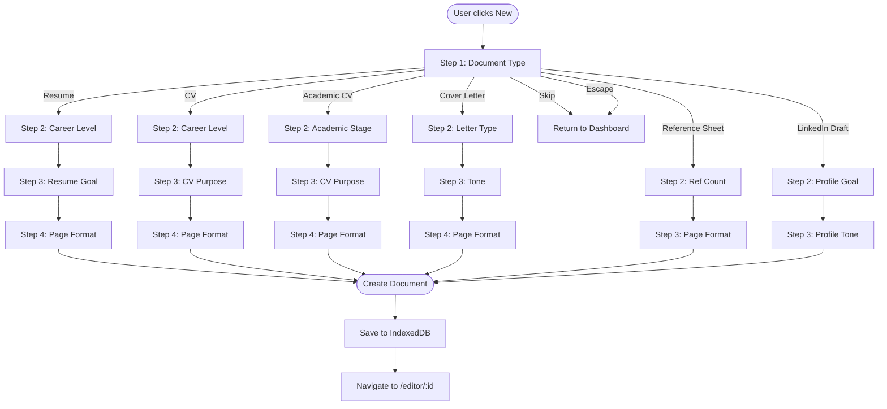

# New Document Flow

> CareerCanvas Application Guide | Generated: 2026-08-12

---

## Overview

New documents are created through the Onboarding Wizard, which presents a multi-step selection flow customized for each document type. The wizard is implemented in `src/js/modules/onboarding.js` (1260 lines).

---

## Wizard Entry Points

| Entry Point | Trigger |
|-------------|---------|
| Dashboard "New Resume" button | Opens wizard with Resume pre-selected |
| Dashboard "New CV" button | Opens wizard with CV pre-selected |
| Dashboard "New Cover Letter" button | Opens wizard with Cover Letter pre-selected |
| Dashboard "+ New" header button | Opens wizard at Document Type selection |
| Ctrl+Shift+N keyboard shortcut | Opens wizard at Document Type selection |

---

## Document Type Selection (Step 1 — All Types)

The first step presents 6 document type options:

| Option | Icon | Description | Schema Type |
|--------|------|-------------|-------------|
| Resume | document | Standard professional resume | `DOCUMENT_TYPES.RESUME` |
| CV | clipboard | Comprehensive curriculum vitae | `DOCUMENT_TYPES.CV` |
| Academic CV | graduation cap | For academic positions and research | (uses CV type) |
| Cover Letter | envelope | Personalized job application letter | `DOCUMENT_TYPES.COVER_LETTER` |
| Reference Sheet | contacts | Professional references list | `DOCUMENT_TYPES.REFERENCE_SHEET` |
| LinkedIn Profile Draft | briefcase | Draft for LinkedIn profile | (uses Resume type) |

---

## Steps Per Document Type

### Resume (4 steps)

| Step | Title | Options |
|------|-------|---------|
| 1 | Choose Document Type | 6 types |
| 2 | Career Level | Entry (0-2yr), Mid (3-5yr), Senior (6-10yr), Executive (10+yr), Career Change |
| 3 | Resume Goal | General, Tailor to Job, ATS-Friendly, Visual, Portfolio |
| 4 | Page Format | A4, US Letter |

### CV (4 steps)

| Step | Title | Options |
|------|-------|---------|
| 1 | Choose Document Type | 6 types |
| 2 | Career Level | Graduate, Experienced (3-7yr), Senior (8+yr), Executive |
| 3 | CV Purpose | General, Targeted, International, Technical |
| 4 | Page Format | A4, US Letter |

### Academic CV (4 steps)

| Step | Title | Options |
|------|-------|---------|
| 1 | Choose Document Type | 6 types |
| 2 | Academic Stage | Grad Student, Postdoc, Asst Prof, Assoc Prof, Full Prof, Researcher |
| 3 | CV Purpose | Faculty Position, Grant Application, Tenure Review, General Academic |
| 4 | Page Format | A4, US Letter |

### Cover Letter (4 steps)

| Step | Title | Options |
|------|-------|---------|
| 1 | Choose Document Type | 6 types |
| 2 | Letter Type | Job Application, Letter of Interest, Referral, Networking |
| 3 | Tone & Style | Formal, Professional, Conversational, Creative |
| 4 | Page Format | A4, US Letter |

### Reference Sheet (3 steps)

| Step | Title | Options |
|------|-------|---------|
| 1 | Choose Document Type | 6 types |
| 2 | Number of References | 3, 4, 5+ |
| 3 | Page Format | A4, US Letter |

### LinkedIn Draft (3 steps)

| Step | Title | Options |
|------|-------|---------|
| 1 | Choose Document Type | 6 types |
| 2 | Profile Goal | Job Search, Networking, Thought Leadership, Business Development |
| 3 | Profile Tone | Professional, Approachable, Expert, Storyteller |

---

## Wizard Controls

| Control | Behavior |
|---------|----------|
| **Continue on Selection** toggle | When ON, selecting an option auto-advances to next step after 300ms. Persisted in localStorage (`cc_continueOnSelection`). |
| **Next** button | Disabled until a selection is made. Changes to "Get Started" on last step. |
| **Back** button | Returns to previous step. On step 0, closes the wizard. |
| **Skip** button | Closes wizard and returns to dashboard without creating a document. |
| **Escape** key | Same as Skip. |
| **Close (X)** button | Same as Skip. |

---

## Document Creation

When the user completes the wizard (clicks "Get Started" on the last step):

1. `getDocumentType()` maps wizard selection to schema type
2. `createEmptyDocument(type)` creates document with type-specific default sections
3. Document saved to IndexedDB `documents` store
4. `DOCUMENT_CREATE` event emitted
5. Router navigates to `/editor/:id`
6. `onboardingComplete` set in localStorage

---

## Feature Showcase

On screens wider than 1100px, the wizard is accompanied by animated feature cards and chips displayed around the modal. Below 1100px, a compact "mobile strip" of feature badges is shown inside the modal. Below 480px, the strip is hidden entirely.

---

## Wizard Flow Diagram

