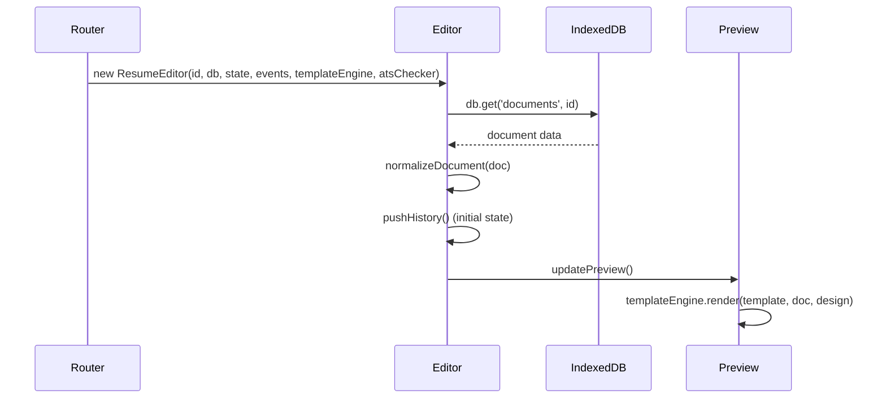
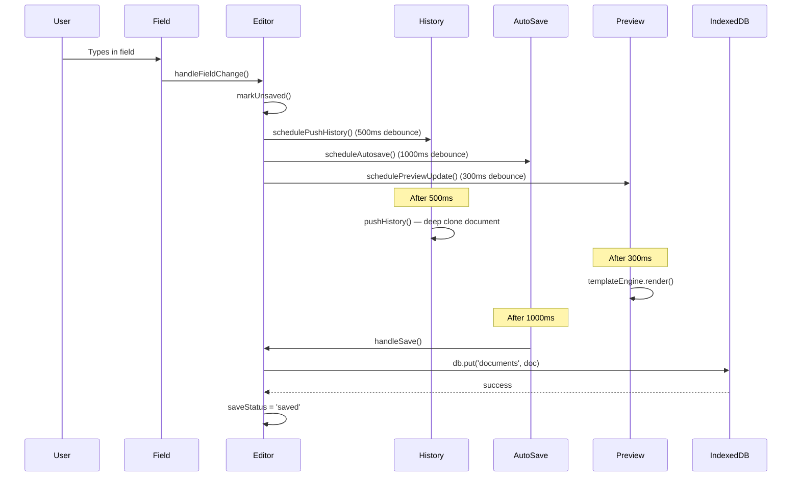
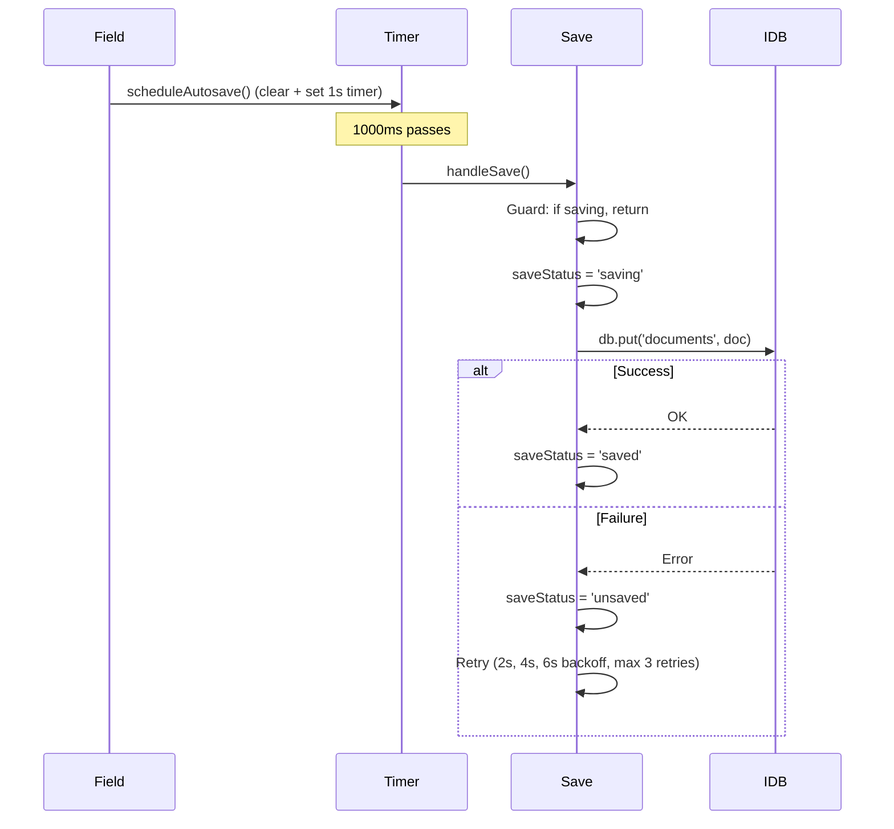

# Editor Flow

> CareerCanvas Application Guide | Generated: 2026-08-12

---

## Overview

The Resume Editor (`src/js/modules/editor.js`, 4813 lines) is the central authoring component. It provides a 3-panel layout with real-time preview, undo/redo, autosave, and integrated design controls.

## Editor Architecture

### Route Entry
`/editor/:id` — the `:id` parameter is a UUID referencing a document in IndexedDB.

### Panel Layout

| Panel | Desktop | Mobile |
|-------|---------|--------|
| **Left** | Form fields, section navigator | Tab "Edit" |
| **Center** | Live preview with zoom controls | Tab "Preview" |
| **Right** | Writing tips, ATS analysis | Tab "Design" / "Export" |

### Document Loading

### Default Design Settings
| Property | Default |
|----------|---------|
| Template | `ats-essential` |
| Page Size | `A4` |
| Font Family | `Arial` |
| Font Size | `11pt` |
| Name Size | `22pt` |
| Heading Size | `14pt` |
| Line Height | `1.4` |
| Accent Color | `#2563eb` |
| Text Color | `#222222` |
| Section Spacing | `16px` |
| Paragraph Spacing | `8px` |

---

## Edit-to-Preview Flow

---

## Undo/Redo Flow

The editor maintains its own undo/redo stack (separate from the centralized StateManager).

| Parameter | Value |
|-----------|-------|
| Max history entries | 50 |
| History push debounce | 500ms |
| Storage | In-memory array of deep-cloned documents |

### Operations

- **Push history**: Deep clones `this.document` via `JSON.parse(JSON.stringify(...))`, appends to array, truncates redo states
- **Undo**: Decrements `historyIndex`, restores deep clone from history
- **Redo**: Increments `historyIndex`, restores forward clone

### Keyboard Shortcuts
| Shortcut | Action |
|----------|--------|
| Ctrl+S | Save document |
| Ctrl+Z | Undo |
| Ctrl+Y | Redo |
| Ctrl+P | Print |
| Ctrl+Shift+A | Toggle ATS Mode |

---

## Autosave Flow

**Save status indicator**: Traffic light dot in toolbar (green=saved, yellow=saving, red=unsaved). Refreshes every 30 seconds.

---

## Section System

### Section Types (11 in editor)

| Type | Render Mode | Entry Fields |
|------|------------|--------------|
| summary | text | Textarea with rich-text expand |
| objective | text | Textarea with rich-text expand |
| experience | list | jobTitle, company, department, location, employmentType, remoteType, dates, roleSummary, achievements[], technologies |
| education | list | degree, field, institution, location, GPA, graduationYear |
| projects | list | projectName, role, URL, description, technologies |
| skills | list | name, proficiency (4 levels) |
| certifications | list | name, organization, year, credentialId |
| languages | list | language, proficiency (5 levels) |
| publications | list | Generic editor |
| awards | list | Generic editor |
| volunteer | list | Generic editor |

### Section Operations
- Add section (from predefined types or custom)
- Remove section (with confirmation)
- Reorder sections (drag-and-drop or keyboard)
- Toggle visibility
- Move to sidebar/main column (2-column templates)
- Expand/collapse

### Entry Operations
- Add entry to section
- Duplicate entry
- Delete entry (with confirmation)
- Reorder entries (drag-and-drop or keyboard)
- Toggle entry visibility (hide/show)
- Expand/collapse entry editor

---

## Rich-Text Editing

### Popup Editor
Opens for text-type sections (summary, objective). Features:
- Contenteditable div with rich-text support
- Format toolbar: Bold, Italic, Underline, Bullet List, Numbered List, Indent, Outdent, Insert Link, Remove Link, Remove Formatting
- Character and word count
- Uses `document.execCommand()` for formatting
- Content sanitized via `rich-text-sanitizer.js` on save

### Floating Toolbar
Appears on text selection in contenteditable areas. Options:
- Bold (B), Italic (I), Underline (U)
- Bullet List, Numbered List
- Link (prompts for URL, rejects `javascript:` URLs)
- Clear Formatting

---

## Design Studio

Opens as a slide-in drawer from the right side. Contains:

1. **Quick Styles** — 7 typography presets
2. **Font Manager** — Font family (37 fonts), size, line height
3. **Photo Controls** — Upload, shape, size slider
4. **Sidebar Width** — Slider for 2-column templates
5. **Full Design Panel** — 8 collapsible groups:
   - Page Setup, Typography, Colors, Section Style, Layout, Photo, Spacing, Advanced

Own undo/redo stack (20 max). Reset to defaults available.

---

## ATS Mode

When enabled (via toolbar button or Ctrl+Shift+A):
1. Font size enforced ≥ 10pt
2. Safe fonts only (Arial, Helvetica, Calibri, etc.)
3. All sections moved to main column
4. Single-column template forced
5. Dark text color enforced
6. Accent color neutralized to black
7. Profile photo hidden

Original settings saved for restoration when ATS mode is toggled off.

---

## Mobile Editor

4 bottom tabs: Edit, Preview, Design, Export

- `data-mobile-view` attribute controls panel visibility
- Preview scales content to fit viewport width
- Bottom tab bar has 60px min-height touch targets
