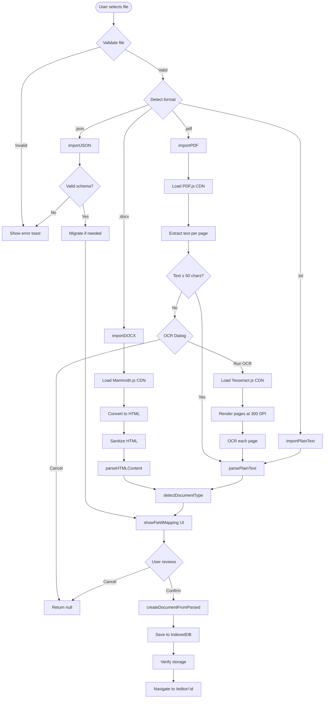
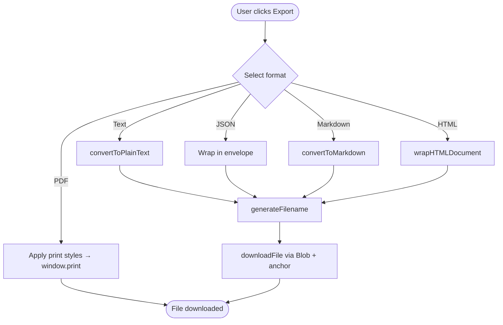

# Import & Export Flow

> CareerCanvas Application Guide | Generated: 2026-08-12

---

## Import Overview

All imports are handled by `ImportManager` (`src/js/modules/import-manager.js`, 2531 lines). Processing is entirely local; external CDN libraries are loaded only for format-specific parsing.

### Supported Import Formats

| Format | Method | External Dependency | Max Size |
|--------|--------|-------------------|----------|
| CareerCanvas JSON | `importJSON(file)` | None | 50MB |
| DOCX | `importDOCX(file)` | Mammoth.js v1.8.0 (CDN) | 50MB |
| PDF | `importPDF(file)` | PDF.js v4.4.168 (CDN) | 50MB |
| Plain Text | `importPlainText(input)` | None | 50MB |
| Scanned PDF (OCR) | `runOCR(pdfDoc, language)` | Tesseract.js v5 (CDN) | 50MB |
| Full Backup | `importAllData(file)` | None | 50MB |

### Import Entry Points

- **Dashboard**: "Import" quick action → navigates to `/import`
- **Import page** (`/import`): Format cards, drag-and-drop zone, paste text area
- **Editor**: Import button in toolbar (PDF, JSON, TXT)
- **Settings**: "Import Backup" button
- **Data Studio** (`/data-backup`): Full/category backup import

---

## Import Flow Diagram

---

## Field Mapping UI

The `showFieldMapping()` method presents a full-screen review overlay with tabs:

| Tab | Content |
|-----|---------|
| **Contact Info** | Editable fields: Full Name, Email, Phone, Location |
| **Sections** | Each section: checkbox (include/exclude), editable title, type dropdown (13 types) |
| **Images** | Thumbnails with size, classification, include checkbox (DOCX only) |
| **Options** | Document Name, Document Type (Resume/CV/Academic CV) |
| **Preview** | Rendered preview of imported content |

### Document Type Detection

`detectDocumentType(parsed)` classifies documents using heuristics:

- **Academic CV**: ≥3 academic section titles (publications, research, teaching, grants, etc.) or ≥2 titles + ≥3 academic content keywords
- **CV**: ≥8 sections with ≥50 content lines, or CV-indicator sections (references, memberships)
- **Resume**: Default for standard section counts

### Duplicate Detection

- `computeFileFingerprint()`: djb2 hash of first 5000 chars
- `checkForDuplicate()`: Checks fingerprint match then name match
- `showDuplicateDialog()`: Offers Open Existing, Import as New, or Replace (requires typing REPLACE)

Note: Duplicate detection infrastructure exists but is not called from DOCX/PDF import paths in current implementation.

### Draft Recovery

- Auto-saves import draft to localStorage (`cc_import_draft`) every 5 seconds
- Draft expires after 24 hours
- Restored if user returns to import page with stale draft

---

## Import Data Transformation

`createDocumentFromParsed()` converts raw parsed data into structured documents:

| Parsed Section Type | Output Item Structure |
|--------------------|-----------------------|
| Experience | `{ jobTitle, company, location, startMonth/Year, endMonth/Year, current, currentlyWorking, achievements[], highlights[], technologies[] }` |
| Education | `{ degree, field, institution, location, graduationYear, gpa, honors }` |
| Skills | `{ category, name, skills[] }` (array, not string) |
| Projects | `{ projectName, name, title, text, summary, technologies[] }` |
| Certifications | `{ name, issuingOrganization, issuer, organization, date, year }` |
| Summary/Objective | `{ content }` in both section.content and items[0].content |

Date parsing (`_parseDateRange`) handles: "Jan 2020 - Mar 2023", "2020 - Present", "01/2020 - 03/2023", "Since 2020", single years.

---

## Export Overview

All exports are handled by `ExportManager` (`src/js/modules/export-manager.js`, 817 lines).

### Supported Export Formats

| Format | Method | Output | Notes |
|--------|--------|--------|-------|
| PDF | `exportPDF()` | Browser print dialog | Uses `window.print()` with print styles |
| Plain Text (.txt) | `exportPlainText()` | Downloaded file | Includes personal info and all sections |
| JSON (.json) | `exportJSON()` | Downloaded file | Wrapped in envelope with metadata |
| Markdown (.md) | `exportMarkdown()` | Downloaded file | Proper MD headers, lists, links |
| HTML (.html) | `exportHTML()` | Downloaded file | Complete HTML5 document with styles |
| Full Backup | `exportAllData()` | Downloaded file | All 11 IndexedDB stores + settings |
| Selective Backup | `exportSelectedStores()` | Downloaded file | Chosen stores only |

**Not supported:** DOCX export

### Export Entry Points

- **Editor toolbar**: Export dropdown (PDF, Text, JSON, Markdown, HTML)
- **Dashboard**: Document card → Export action
- **Settings**: "Export Backup" button
- **Data Studio**: Full/category export
- **Job Matcher**: Export analysis as JSON/Text
- **Skills Matrix**: Export as CSV/JSON/Text
- **Portfolio Studio**: Export as self-contained HTML

### Export Flow Diagram

### Filename Generation

Format: `{PersonName}_{TargetRole}_{DocType}.{ext}`

Example: `Jane_Doe_Software_Engineer_Resume.pdf`

Falls back to document name if personal info is incomplete.

---

## Round-Trip Expectations

| Format | Preserves Structure | Preserves Design | Re-importable |
|--------|-------------------|-----------------|---------------|
| JSON | Full | Full | Yes (lossless) |
| Plain Text | Partial (sections) | No | Yes (with parsing) |
| Markdown | Partial | No | Yes (with parsing) |
| HTML | Visual | Inline styles | No |
| PDF | Visual | Print layout | Yes (with text extraction) |
| Full Backup | Full (all stores) | Full | Yes (lossless) |
