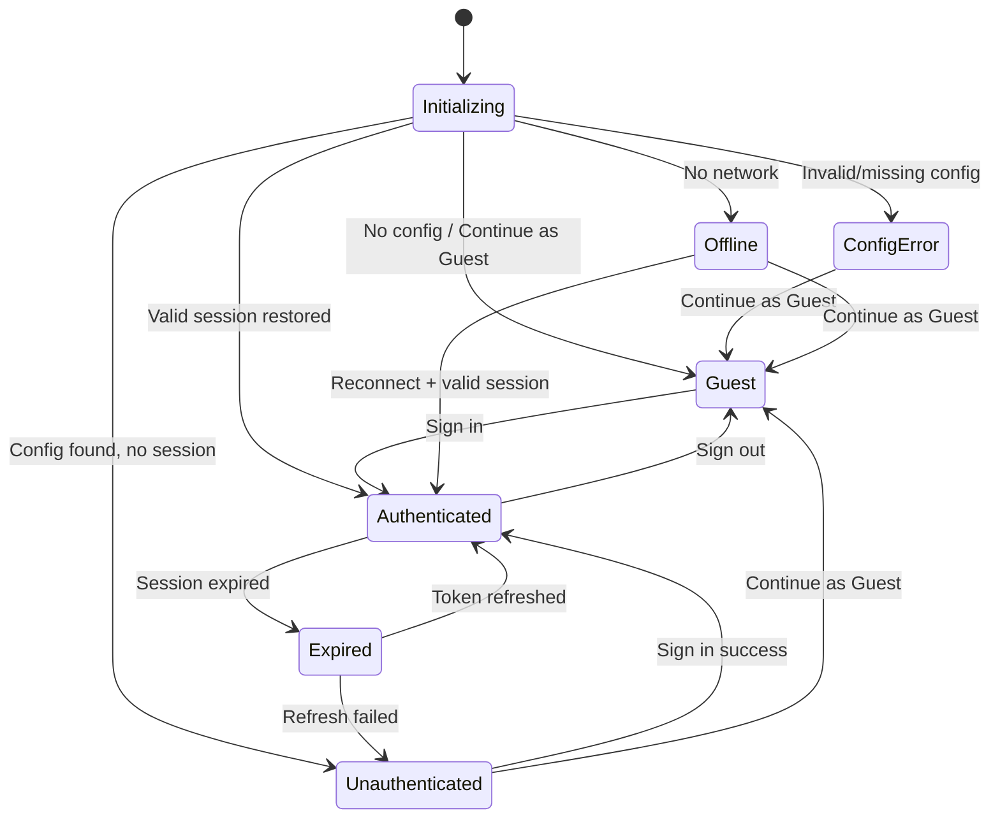

# Authentication Flow

> CareerCanvas Application Guide | Generated: 2026-08-12

---

## Authentication Model

CareerCanvas uses an optional authentication system powered by Supabase. Authentication is **not required** for any core functionality — all features work in guest mode with local-only data storage.

### Authentication States

| State | Value | Description |
|-------|-------|-------------|
| `INITIALIZING` | `'initializing'` | Auth system loading |
| `AUTHENTICATED` | `'authenticated'` | Valid Supabase session |
| `UNAUTHENTICATED` | `'unauthenticated'` | No session, config available |
| `GUEST` | `'guest'` | Local-only mode, no account |
| `EXPIRED` | `'expired'` | Session token expired |
| `CONFIG_ERROR` | `'config_error'` | Supabase config invalid/missing |
| `PROVIDER_ERROR` | `'provider_error'` | Supabase API error |
| `OFFLINE` | `'offline'` | No network connectivity |

---

## Authentication Provider

**Provider:** Supabase (loaded from CDN: `@supabase/supabase-js@2`)

**Supported methods:**
- Email/password sign-up and sign-in
- Magic link (passwordless email OTP) — requires `AUTH_MAGIC_LINK_ENABLED=true`
- Google OAuth — requires `AUTH_GOOGLE_ENABLED=true`
- PKCE flow for enhanced security

**Configuration:** Loaded from `/api/public-config` Vercel endpoint or `window.__CC_AUTH_CONFIG__`

**Required environment variables:**
- `SUPABASE_URL` — Supabase project URL
- `SUPABASE_ANON_KEY` — Supabase anonymous key
- `PUBLIC_SITE_URL` — Site URL for redirects
- `SUPABASE_SERVICE_ROLE_KEY` — Server-side only (for account deletion)

---

## Authentication Routes

| Route | Purpose | Access |
|-------|---------|--------|
| `/welcome` | Landing page with guest/sign-in CTAs | Public |
| `/login` | Email/password sign-in form | Public |
| `/signup` | Account registration form | Public |
| `/verify-email` | Email verification confirmation | Public |
| `/forgot-password` | Password reset request | Public |
| `/reset-password` | New password entry | Public |
| `/auth/callback` | OAuth/magic link callback handler | Public |
| `/account/profile` | Display name editor | Auth required |
| `/account/security` | Password change, account deletion | Auth required |

---

## Guest Mode

- Set by `continueAsGuest()`: stores `cc_auth_guest = 'true'` in localStorage
- All features fully functional
- All data stored locally in IndexedDB and localStorage
- No network requests for authentication
- Guest can sign in later without losing data

---

## Sign Up Flow

1. User navigates to `/signup`
2. Fills: Display Name, Email, Password, Confirm Password
3. Accepts terms checkbox
4. `signUp({ email, password, displayName })` calls Supabase
5. On success: navigates to `/verify-email` with masked email displayed
6. User checks email, clicks verification link
7. Link redirects to `/#/auth/callback`
8. Callback handler processes verification
9. Auth state changes to `AUTHENTICATED`
10. Router navigates to intended route or `/dashboard`

---

## Sign In Flow

1. User navigates to `/login`
2. Enters email and password
3. `signInWithPassword({ email, password })` calls Supabase
4. On success: `cc_auth_guest` removed from localStorage
5. Auth state changes to `AUTHENTICATED`
6. Router navigates to intended route or `/dashboard`

---

## Sign Out Flow

1. User clicks Sign Out in account menu
2. `signOut()` calls Supabase
3. `cc_auth_guest` set to `'true'` (falls back to guest)
4. Auth state changes to `GUEST`
5. All local documents remain intact
6. User can continue working as guest

---

## Intended Route Preservation

- When a user tries to access an auth-protected route without being authenticated, the route is saved via `setIntendedRoute()`
- Stored route expires after 10 minutes
- After successful sign-in, the user is redirected to the saved route
- Auth-related routes are excluded from intended-route storage

---

## Account Management

### Profile (`/account/profile`)
- Edit display name
- View email (read-only)

### Security (`/account/security`)
- Change password
- Delete account (requires typing "DELETE" to confirm)
- Account deletion calls `/api/delete-account` with Bearer token
- Server-side deletion uses Supabase admin API

---

## Data Boundary

**Critical:** Authentication is identity-only. No document data is stored on any server.

- Documents remain in local IndexedDB regardless of auth state
- Signing out does not delete local data
- Signing in does not upload local data
- Cloud synchronization is not implemented
- Multiple devices cannot share documents through authentication
