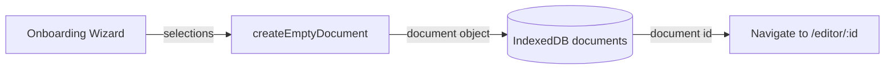
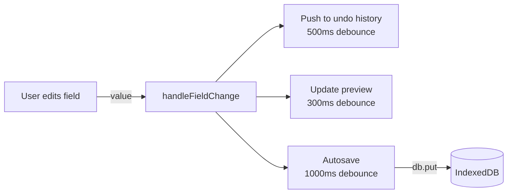
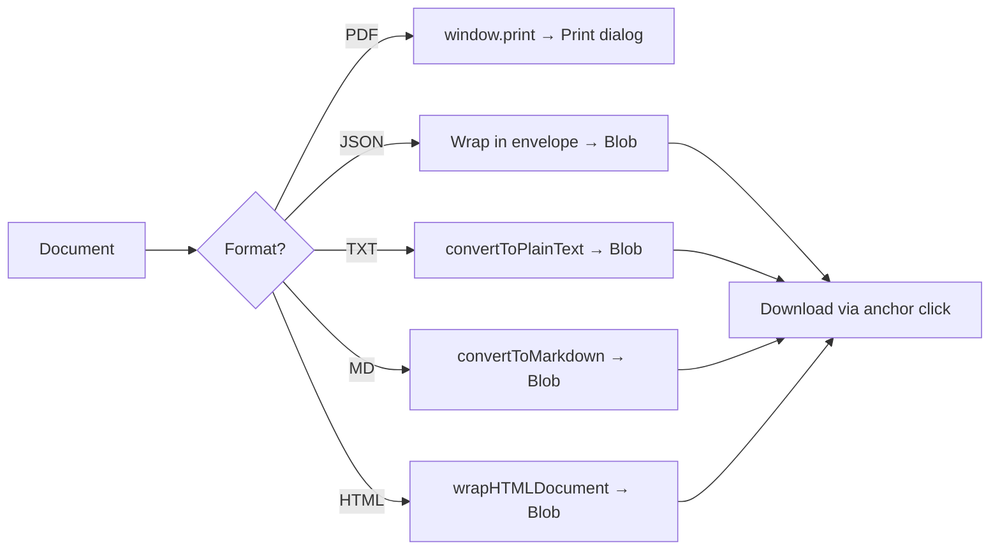
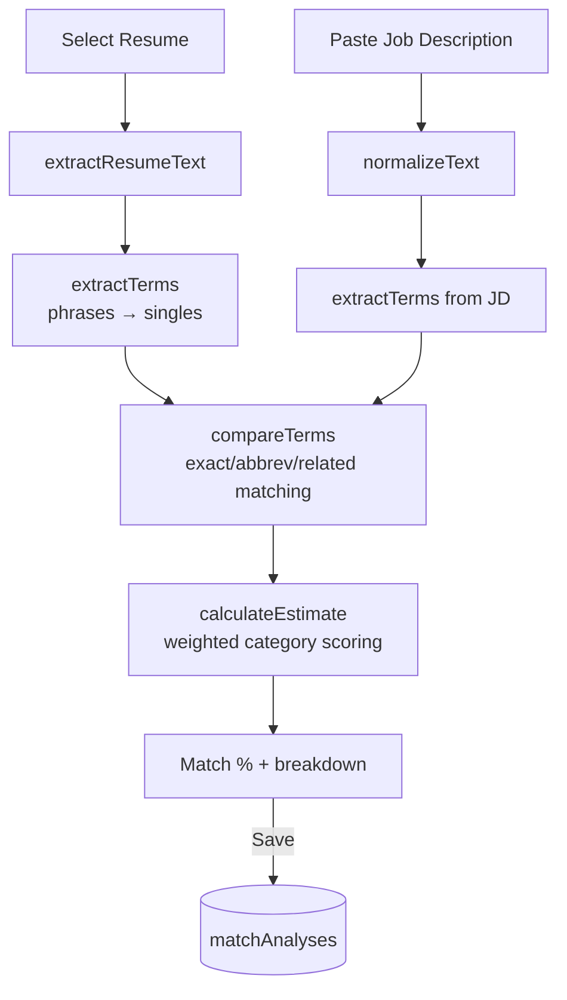
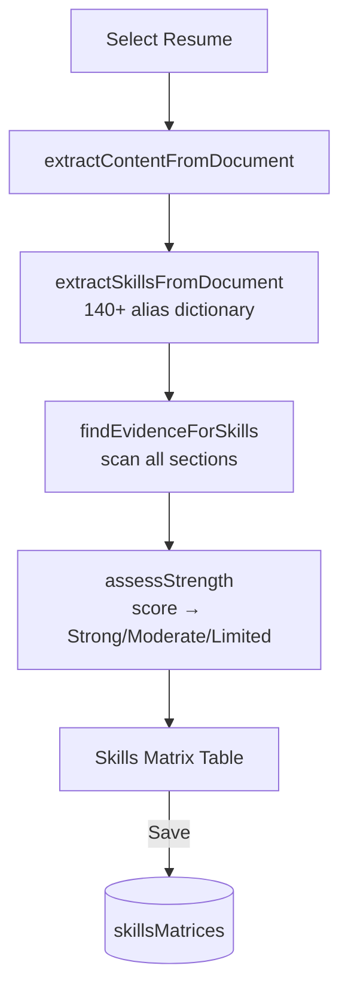
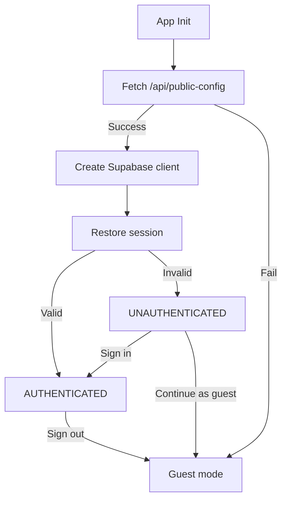
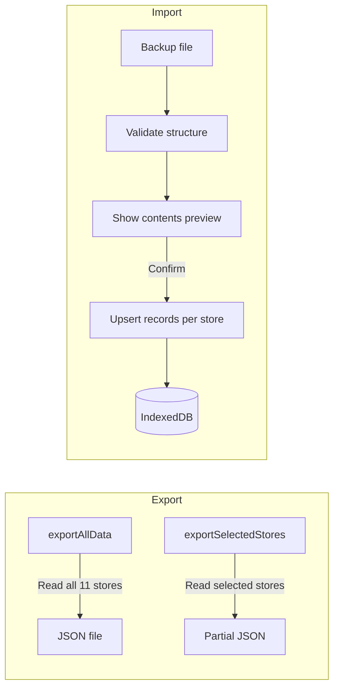

# Data Flow

> CareerCanvas Application Guide | Generated: 2026-08-12

---

## Document Creation Flow



## Document Editing Flow



## Import Flow

```mermaid
flowchart TD
    File[Selected File] --> Validate[Validate size/type]
    Validate --> Parse{Format?}
    Parse -->|JSON| ParseJSON[Parse + validate schema]
    Parse -->|DOCX| ParseDOCX[Mammoth.js → HTML → parseHTMLContent]
    Parse -->|PDF| ParsePDF[PDF.js → text extraction]
    Parse -->|TXT| ParseTXT[parsePlainText]
    ParsePDF -->|< 50 chars| OCR[Tesseract.js OCR]
    OCR --> ParseTXT
    ParseJSON --> Review[Field Mapping UI]
    ParseDOCX --> Detect[detectDocumentType]
    ParseTXT --> Detect
    Detect --> Review
    Review -->|Confirm| Build[createDocumentFromParsed]
    Build --> IDB[(IndexedDB)]
    IDB --> Editor[/editor/:id]
```

## Export Flow



## Template Application Flow

```mermaid
flowchart LR
    Gallery[Template Gallery] -->|Select template| Create[createEmptyDocument]
    Create -->|Set templateId| Apply[Apply color/font presets]
    Apply -->|Save| IDB[(IndexedDB)]
    IDB --> Editor[/editor/:id]

    EditorChange[Editor: Change Template] -->|New templateId| Update[Update doc.design]
    Update -->|Autosave| IDB2[(IndexedDB)]
    IDB2 --> Render[Re-render preview]
```

## Job Matcher Flow



## Skills Matrix Flow



## Authentication Flow



## Backup and Restore Flow


