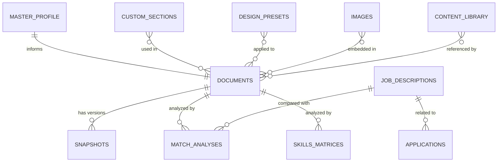

# Storage Architecture

> CareerCanvas Application Guide | Generated: 2026-08-12

---

## IndexedDB

**Database name:** `careercanvas-db`
**Current version:** 4

### Object Stores (11)

| Store | Key Path | Version Added | Indexes |
|-------|----------|---------------|---------|
| `documents` | `id` | v1 | type, lastModified, tags (multiEntry), pinned, archived, targetRole |
| `masterProfile` | `id` | v1 | type, lastModified |
| `jobDescriptions` | `id` | v1 | company, role, lastModified, tags (multiEntry) |
| `applications` | `id` | v1 | company, role, status, appliedDate, lastModified |
| `contentLibrary` | `id` | v1 | type, category, tags (multiEntry), lastModified |
| `snapshots` | `id` | v1 | documentId, createdAt |
| `images` | `id` | v1 | type, lastModified |
| `designPresets` | `id` | v1 | name, category |
| `matchAnalyses` | `id` | v2 | resumeId, jobDescriptionId, createdAt, lastModified |
| `skillsMatrices` | `id` | v3 | documentId, createdAt, lastModified |
| `customSections` | `id` | v4 | name, category, createdAt |

### Entity Relationship Diagram

### CRUD Operations

The `Database` class provides:

| Method | Description |
|--------|-------------|
| `create(store, data)` | Add new record |
| `read(store, id)` / `get(store, id)` | Get by primary key |
| `update(store, data)` / `put(store, data)` | Upsert record |
| `delete(store, id)` | Remove record |
| `getAll(store)` | Get all records |
| `getByIndex(store, index, value)` | Query by index |
| `query(store, filterFn)` | Filter with callback |
| `count(store)` | Count records |
| `clear(store)` | Delete all records in store |
| `estimateStorage()` | Get storage usage estimate |
| `exportAll()` | Export all stores |
| `importAll(data)` | Import all stores |

---

## localStorage Keys (~30)

### Application Settings

| Key | Purpose | Default | Values |
|-----|---------|---------|--------|
| `cc_app_theme` | Active UI theme ID | `midnight-professional` | Theme ID string |
| `cc_custom_themes` | Custom theme definitions | `[]` | JSON array |
| `cc_default_pagesize` | Default page size | `a4` | a4, letter, legal, a5 |
| `cc_default_zoom` | Default preview zoom | `fit` | fit, 75, 100, 125, 150 |
| `cc_autosave` | Autosave enabled | `true` | true/false |
| `cc_charcounts` | Show character counts | `true` | true/false |
| `cc_tips` | Show writing tips | `true` | true/false |
| `cc_spellcheck` | Spell check enabled | `true` | true/false |
| `cc_reduce_motion` | Reduce animations | `false` | true/false |
| `cc_high_contrast` | High contrast mode | `false` | true/false |
| `cc_ui_fontsize` | UI font size | `medium` | small, medium, large, xlarge |
| `userSettings` | Legacy settings object | `{}` | JSON object |

### Authentication

| Key | Purpose | Default | Values |
|-----|---------|---------|--------|
| `cc_auth_guest` | Guest mode flag | Not set | `'true'` |
| `onboardingComplete` | Wizard completed | Not set | `'true'` |
| `cc_verify_email` | Email for verification | Not set | Email string |

### Tool/Studio Data

| Key | Purpose |
|-----|---------|
| `cc_timeline_events` | Custom timeline events (JSON) |
| `cc_packages` | Application packages (JSON) |
| `cc_portfolio_config` | Portfolio configuration (JSON) |
| `cc_links` | Links for QR studio (JSON) |
| `cc_localization` | Localization settings (JSON) |
| `templateFavorites` | Favorited template IDs (JSON) |
| `designPresets` | Saved design presets (JSON) |
| `cc_ai_api_key` | User-provided AI API key |
| `cc_online_suggestions` | Online autocomplete toggle |

### Migration

| Key | Purpose |
|-----|---------|
| `careercanvas_migration_version` | Current migration version |
| `careercanvas_migration_history` | Migration execution log |
| `careercanvas_migration_backup_v*` | Pre-migration backups |

### Import

| Key | Purpose |
|-----|---------|
| `cc_import_draft` | In-progress import draft (24h TTL) |

---

## Data Classification

| Category | Examples | Storage |
|----------|----------|---------|
| **Local Private** | Documents, personal info, sections | IndexedDB |
| **Local Preferences** | Theme, page size, zoom | localStorage |
| **Tool State** | Timeline events, packages, links | localStorage |
| **Analysis Results** | Match analyses, skills matrices | IndexedDB |
| **Transient** | Editor undo history, preview HTML | Memory only |
| **Account Data** | Auth session, user profile | Supabase (optional) |
| **External Provider** | AI analysis results | Groq API (optional) |
| **Secrets** | API keys | localStorage (cc_ai_api_key) or server env |
